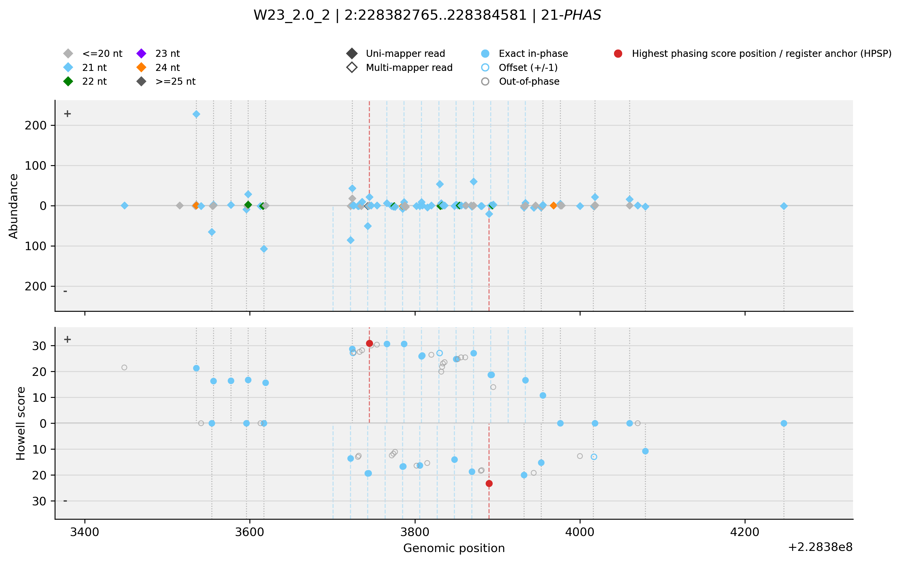

# Phasis — Phased sRNA Cluster Discovery and Annotation

**Version:** v2.6  
**Updated:** 2026-04-13

Phasis is a parallelized tool for large-scale analysis of small RNA (sRNA) libraries. It supports:

- *De novo* discovery of ***PHAS* loci** and precursor transcripts
- Summarization and comparison of *PHAS* loci across stages, tissues, and treatments
- Quantification and annotation of *PHAS* loci

---

## Installation

### Standardized installation target

Phasis is currently documented against this setup:

- **Python / environment**
  - Python **3.12**

- **External executables**
  - **HISAT2** `>= 2.2.1`
  - **samtools** available on your `PATH`

- **Python packages**
  - **NumPy** `1.26.4`
  - **Pandas**
  - **SciPy**
  - **scikit-learn** `1.3.0`
  - **Matplotlib**
  - **Seaborn**
  - **Joblib**
  - **tqdm**

This NumPy / scikit-learn pairing is intentional. Phasis currently targets:

- **NumPy** `1.26.4`
- **scikit-learn** `1.3.0`

Do **not** use NumPy `2.x` with the current Phasis release, because `scikit-learn 1.3.0` is not compatible with that series.

### 1) Create an environment

**Conda (recommended):**
```bash
conda create -n phasis python=3.12 -y
conda activate phasis
conda install "numpy=1.26.4" "scikit-learn=1.3.0" -y
```

### 2) Install external tools

Phasis requires these executables on your `PATH`:

- **hisat2**
- **samtools**

Install via conda (example):
```bash
conda install -c bioconda hisat2 samtools -y
```

### 3) Install Phasis

After downloading or cloning the repository, extract it if needed and open a terminal in the project folder.

Then change into the Phasis repository root and install it with `pip`:
```bash
cd Phasis
python -m pip install -U pip
python -m pip install -e .
```

Verify the installation environment:
```bash
python -c "import numpy, sklearn; print('numpy', numpy.__version__); print('sklearn', sklearn.__version__)"
```

Expected output:
```bash
numpy 1.26.4
sklearn 1.3.0
```

This installs the current local copy of Phasis and should make the `phasis` command available:
```bash
phasis -h
```

---

## Running example (maize tag-counts from GEO)

This end-to-end example downloads **tag-count** libraries from GEO and the **B73 RefGen v2 (AGPv2)** genome, then runs Phasis for 21-*PHAS* and 24-*PHAS*.

```bash
mkdir -p phasis_example
cd phasis_example

# Retrieve from GEO the tabular delimited small RNA accumulation files (tag-count)
wget "https://www.ncbi.nlm.nih.gov/geo/download/?acc=GSM3466697&format=file&file=GSM3466697%5F7570%5Fchopped%2Etxt%2Egz" -O sTP_dcl5_1_2.0.tag.gz
wget "https://www.ncbi.nlm.nih.gov/geo/download/?acc=GSM4180401&format=file&file=GSM4180401%5FTP%5FW23%5F2%5F0%5F1%5Fchopped%2Etxt%2Egz" -O W23_2.0_1.tag.gz
wget "https://www.ncbi.nlm.nih.gov/geo/download/?acc=GSM4180402&format=file&file=GSM4180402%5FTP%5FW23%5F2%5F0%5F2%5Fchopped%2Etxt%2Egz" -O W23_2.0_2.tag.gz
wget "https://www.ncbi.nlm.nih.gov/geo/download/?acc=GSM3466699&format=file&file=GSM3466699%5F7569%5Fchopped%2Etxt%2Egz" -O sTR_dcl5_1_2.0.tag.gz

# Download the maize genome B73_RefGen_v2/AGPv2
wget https://download.maizegdb.org/B73_RefGen_v2/B73_RefGen_v2.fa.gz

# Detect 21-PHAS
phasis -mindepth 1 -phase 21 -libformat T -classifier KNN -reference B73_RefGen_v2.fa.gz -cores 12 -maxhits 25 -libs sTR_dcl5_1_2.0.tag.gz W23_2.0_2.tag.gz sTP_dcl5_1_2.0.tag.gz W23_2.0_1.tag.gz

# Detect 24-PHAS (same run directory allows reuse of the HISAT2 index)
phasis -mindepth 1 -phase 24 -libformat T -classifier KNN -reference B73_RefGen_v2.fa.gz -cores 12 -maxhits 25 -libs sTR_dcl5_1_2.0.tag.gz W23_2.0_2.tag.gz sTP_dcl5_1_2.0.tag.gz W23_2.0_1.tag.gz
```

## How Phasis writes files (important)

Phasis uses **two locations**:

1) **Run directory** = your current working directory (the directory you run `phasis` from)  
   - Intermediate files (e.g., `21_candidate.loci_table.tab`, `21_processed_clusters.tab`, etc.)
   - Reusable caches such as:
     - `index/` (HISAT2 index)
     - `processed_libraries/` (processed versions of input libraries, stored as `.fas.gz` for reuse)
     - `phasis.mem` (hash cache that decides what can be reused across runs/phases)

2) **Output directory (`--outdir`)**  
   - Final outputs for the selected phase (default: `{phase}_results`)

This design allows you to run 21-*PHAS* and then 24-*PHAS* from the same run directory while reusing safe intermediates (especially the HISAT2 index).

---

## Quick start

### 21-*PHAS* (default)
```bash
phasis -libs *.tag -libformat T -reference genome.fa -phase 21 -cores 0
```

### 24-*PHAS*
```bash
phasis -libs *.tag -libformat T -reference genome.fa -phase 24 -cores 0
```

You can keep the same run directory and let Phasis reuse `index/` and other intermediates via `phasis.mem`.

---

## Outputs

For each phase (e.g., `21`, `24`), Phasis writes the main outputs into `--outdir` (default: `{phase}_results`).
In the filenames below, `{method}` is the classifier used for the run, currently `KNN` or `GMM`.

1. **Main table of detected *PHAS* loci**  
   Filename: **`{phase}_{method}_calls.tsv`**  
   This is the most direct summary of the final *PHAS* calls. It lists each detected locus, where it is in the genome, which library it came from, its phasing score, and the Peak Howell score values.

2. **Full table of all evaluated clusters**  
   Filename: **`{phase}_{method}_all_clusters.tsv`**  
   Use this when you want the full picture, not only the final *PHAS* calls. It includes both *PHAS* and non-*PHAS* clusters together with the features and labels used during classification.

3. **Genome annotation file for detected *PHAS* loci**  
   Filename: **`{phase}_PHAS.gff`**  
   This file is intended for downstream genome-based analyses and visualization in genome browsers or other annotation-aware tools.

4. **Classification heatmap**  
   Filename: **`{phase}_{method}_PHAS.pdf`**  
   This PDF gives a quick visual overview of how each locus was classified in each library: *PHAS*, non-*PHAS*, or not detected.

5. **Heatmap of *PHAS* abundance**  
   Filename: **`{method}_{phase}_Abundance_PHAS.pdf`**  
   This PDF focuses only on loci classified as *PHAS* and shows their length-normalized phased-cluster abundance across libraries.

6. **Combined abundance heatmap for *PHAS* and non-*PHAS* signal**  
   Filename: **`{method}_{phase}_Abundance_PHAS_and_nonPHAS.pdf`**  
   This PDF helps compare phased and non-phased signal side by side across the same loci and libraries, which can be useful for judging how distinct the *PHAS* pattern is.

7. **Howell score heatmaps**  
   Filename: **`{method}_{phase}_Howell_scores.pdf`**  
   This PDF contains **two heatmaps**. One shows the Peak Howell score, which summarizes phasing-support signal, and the other shows the Peak Howell score (strict), a more conservative version based on the stricter/classic scoring scheme.

8. **Individual *PHAS* locus diagnostic plots**  
   Directory: **`{phase}_{method}_PHAS_locus_plots/`**  
   Phasis writes one PNG per final *PHAS* call, named as **`{alib}__{identifier}.png`**. Each plot has two panels for the same locus:
   - the top panel shows strand-separated read abundance, colored by sRNA length and styled as filled/open diamonds for uni- and multi-mappers
   - the bottom panel shows the relaxed Howell-score trace on both strands, including the exact/offset register pattern and the highest phasing score position (HPSP)
   - the **phase-colored vertical bars** mark the 10-cycle register window that actually contributes to the Howell score around the HPSP for that strand
   - the **darker extension bars** mark additional positions outside that 10-cycle window that still map to the same phased register
   - the **red vertical bar** marks the HPSP register anchor itself

   These figures are meant to help users visually inspect the phasing register at each called locus and judge whether a run should be made more or less restrictive.

   Example:

   

9. **Per-locus phased-register phasiRNA table**  
   Filename: **`{phase}_{method}_phasiRNAs.tsv`**  
   This TSV contains one row per exported phase-length phasiRNA that supports a final *PHAS* locus in the plotted phased register. It records the observed read position, the expected register position, the support class (`core_exact`, `core_offset`, or `extended_exact`), the abundance, the sequence, and the mapper count when available.

   Small synthetic 24-nt example:

   | identifier | cID | alib | phase | strand | observed_pos | expected_register_pos | register_class | abun | tag_seq | hits |
   | --- | --- | --- | --- | --- | --- | --- | --- | --- | --- | --- |
   | chr1:100..196 | cluster_1 | libA | 24 | w | 100 | 100 | core_exact | 53 | ATCG... | 1 |
   | chr1:100..196 | cluster_1 | libA | 24 | w | 125 | 124 | core_offset | 31 | TGCA... | 1 |
   | chr1:100..196 | cluster_1 | libA | 24 | w | 172 | 172 | extended_exact | 18 | GATC... | 2 |

   How to read these columns:
   - `expected_register_pos` is the phased genomic register position that PHASIS is tracking for that row.
   - `core_exact` means the read mapped exactly onto one of the 10-cycle register positions used in the Howell-score quantification window.
   - `core_offset` means there was no exact phase-length read at that core register position, so PHASIS exported the winning `+/-1` offset read instead. In the example above, the expected phased position is `124`, but the exported read was observed at `125`.
   - `extended_exact` means the read mapped exactly to the same phased register outside the core 10-cycle Howell window. These are the reads that correspond to the darker extension guide lines in the locus plot.
   - Offset-only reads are not exported for the extended register.
   - A locus can have more than one exported row for the same `expected_register_pos` if multiple phase-length reads with different sequences map exactly at that same phased position.

---

## Common options

- `-libs`: input libraries to process; accepted formats depend on `-libformat` and can be plain text or `.gz`
- `-reference`: genome or transcriptome reference FASTA; can be plain text or `.gz`
- `-maxhits` (default: 25): `-k` passed to hisat2
- `-runtype` (default: G): `G` genome | `T` transcriptome | `S` scaffolded genome
- `-mindepth` (default: 2): minimum depth for p-value computation
- `-uniqueRatioCut` (default: 0.2): filter for uniquely mapped reads
- `-max_complexity` (default: 0.3): maximum complexity filter
- `-mismat` (default: 0): mismatches allowed in mapping
- `-libformat` (default: F): `F` FASTA | `T` tag-count | `Q` FASTQ
- `-phase` (default: 21): phasing length (21 or 24 common)
- `-clustbuffer` (default: 300): merging distance between clusters
- `-phasisScoreCutoff` (default: 50 for 21; internally clamped for 24 to 250–300)
- `-minClusterLength` (default: 350)
- `-cores` (default: 0): 0 uses most free cores; `>0` sets exact core count
- `-norm`: enable CP10M normalization (use `-norm_factor` to change factor; default `1e7`)
- `-norm_factor` (default: `1e7`): normalization factor used when `-norm` is enabled
- `-classifier` (default: KNN): `KNN` or `GMM`
- `-steps` (default: both): `both` | `cfind` | `class`
- `-class_cluster_file`: cluster file(s) to classify when running with `-steps class`
- `-min_Howell_score` (default: 12.5): minimum Howell score used during classification/output filtering
- `--concat_libs`: concatenate all input libraries into one virtual library before downstream analysis
- `--outdir` (default: `{phase}_results`): directory for final outputs; supports `{phase}` in the name
- `--plot_staging` (default: `auto`): individual locus plot write mode; `auto` stages to local scratch when PHASIS detects an HPC-style environment or remote/distributed output path, `local` forces scratch staging, and `direct` writes plots straight to the requested output directory
- `-cleanup`: cleanup-only mode; delete intermediate files but keep `index/`, keep the results directory, and keep only the index-related section of `phasis.mem`; refuses to run unless the current directory looks like a real Phasis run root
- `-cleanup_all` (alias: `-cleanup_index`): cleanup-only mode; delete intermediates, `index/`, and `phasis.mem`, while keeping the results directory; refuses to run unless the current directory looks like a real Phasis run root
- `-version`: print the installed Phasis version and exit

---

## High-sensitivity two-step workflow

This approach is useful when you want to be permissive during clustering and then classify jointly.

### Step 1 — cluster detection
```bash
phasis -mindepth 1 -phase 24 -libformat T -classifier KNN \
  -libs *.tag -reference genome.fa -cores 0 -maxhits 2000 \
  -steps cfind -uniqueRatioCut 0.05
```

### Step 2 — classification
```bash
phasis -mindepth 1 -phase 24 -libformat T -classifier KNN \
  -libs *.tag -reference genome.fa -cores 0 -maxhits 2000 \
  -steps class -class_cluster_file *24-PHAS.candidate.clusters \
  -uniqueRatioCut 0.05
```

Notes:
- Setting `uniqueRatioCut` too low (e.g., 0.0) can dramatically increase runtime and memory in TE-rich genomes.
- Keeping the **same run directory** between steps lets Phasis reuse intermediates safely.

---

## Input library formats

Phasis accepts three library formats:

- **FASTA** (`-libformat F`) — plain text or gzip-compressed (`.gz`)
- **Tag-count** (`-libformat T`) — plain text or gzip-compressed (`.gz`); recommended when FASTA is large or contains many ambiguous bases.
- **FASTQ** (`-libformat Q`) — quality-controlled FASTQ, plain text or gzip-compressed (`.gz`)

The reference FASTA given to `-reference` can also be plain text or gzip-compressed (`.gz`).
For any supported library input format, Phasis converts the processed library into an internal `.fas.gz` file and stores it under `processed_libraries/` in the run directory so it can be reused safely in later runs.

### Run directly from FASTQ
```bash
phasis -libs sample.fastq.gz other_sample.fastq.gz -reference genome.fa.gz -libformat Q
```

### Convert FASTA → tag-count
Script: `support_scripts/fastaToTag.py`
```bash
python support_scripts/fastaToTag.py sample.fasta
```

Then run Phasis, for example:
```bash
phasis -libs *.tag -reference genome.fa -libformat T
```

---

## FASTA headers: non-integer chromosome IDs

Phasis uses FASTA headers as keys. Very long or non-integer chromosome IDs can increase memory usage and may cause failures.

Use:
```bash
python support_scripts/replace_genome_headers.py genome.fa new_genome.fa equivalence.tsv
```

This writes:
- `new_genome.fa` with integer chromosome IDs
- `equivalence.tsv` mapping old → new IDs

---

## Comparing *PHAS* loci between runs (phasMatch)

Script:
```bash
python support_scripts/phasMatch.py <phasis.result.tsv> <alternative_predictions.tsv>
```

The script matches loci using genomic overlap with a default ±300 nt flanking.

---

## Authors

- Thales Henrique Cherubino Ribeiro — thalescherubino@gmail.com
- Atul Kakrana — kakrana@gmail.com  
- Blake Meyers - bcmeyers@ucdavis.edu
